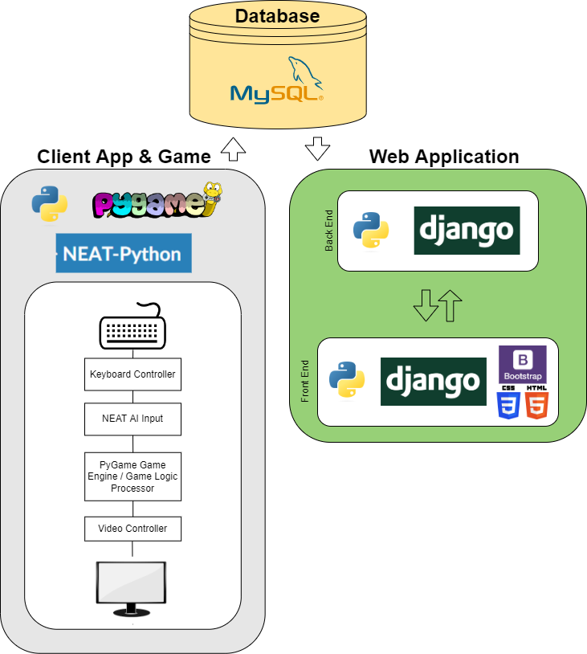

# Neat-is-Neat-Senior-Project
*Python, Pygame, Django, NEAT AI*

## ABSTRACT

The “NEAT is Neat” project will consist of a main application containing a game and an Artificial Intelligence bot paired with a secondary web application to fetch/display data from the main application. The project is intended to further one’s understanding of how an Artificial Intelligence bot evolves to play games proficiently through the creation of an AI that plays games proficiently.

Within the main application, the user will be able to select whether they’d like to see a visual demonstration of the AI evolving and playing the game as it evolves or whether they’d like to play the game on their own. The game will be fairly simple, having a couple of objectives in which the player (and/or AI) will be expected to play indefinitely, trying to reach as far in the level as possible while collecting items like worms. Score will be determined by the distance that the player (and/or AI) achieves within the game and by the number of worms collected within that distance. The player (and/or AI) will play until the game is considered over; this is when the player (and/or AI) dies/ collides with an obstacle. There will only be one stage/level, which will have randomized worms to pick up and randomized obstacles to dodge. The AI will need to be taught through configuration of which actions are preferred and which actions are undesirable. The game will be looped until the AI evolves enough to play proficiently. With each iteration of the game, the AI should get progressively better by increasing its score through completing preferred actions like gaining worms or getting farther in the stage. At some point down the iteration line, the AI should be able to play the game as well as, if not better than, a human player.

The scores, distances travelled, coins collected, AI details/characteristics, and other information will be recorded and posted to a database. The before-mentioned web application will then fetch and display this data for observation purposes in addition to providing general information on the technology used to achieve this.

### Design

The project consists of a main python script using Pygame with an implemented Neuro Evolutionary AI (NEAT-Python) and a secondary Python (Django) web-application. The Main script will post Generational AI details/ results to a MySQL database that the Django web-application will retrieve and display. 

The user can start the main python script via a terminal.  Upon start of the main script, the user will be prompted via a Pygame GUI to select whether they’d like to play the game or view the AI demo. Based on their selection, the game module will be launched and they will be loaded into their selection. If they chose to play the game, a game window will open in which they can control a “fish” and navigate him through the “water”, collecting worms and avoiding “fishermen” and “sharks” while attempting to go the furthest distance possible. If they chose to view the AI demo, they will be loaded into a visual demonstration where they can watch the AI attempt the same game through evolving generations. With each generation of the game, the main python script will create a model and post that generation’s data to the MySQL database.

A Django application will support viewing informational pages, logging in, registering, and the viewing of generational ai data that it will pull from a MySQL database. The Django app will be cloud hosted within an Elastic Beanstalk container in AWS, using AWS EC2 to store the app and AWS RDS to store the database information and data.

 Please refer to the [Documentation within this repository](Documentation/) for a flowchart depicting the process flow of the main script. Proposed user interface diagrams for both the script and the Django web-application can also be found in that section as well.  
 
 

