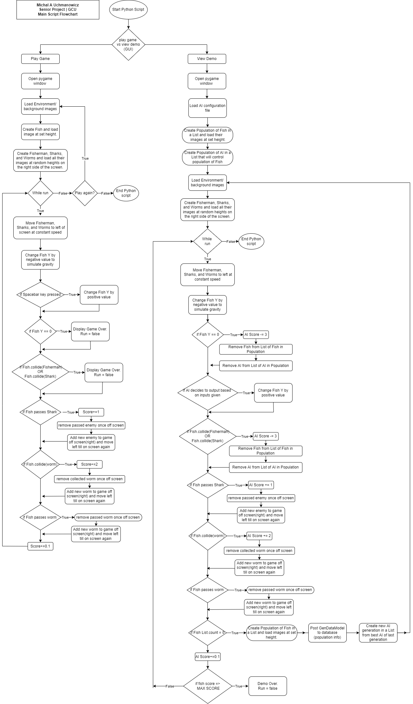

# Neat is Neat Senior Project Design
Michal A Uchmanowicz, Grand Canyon University, 2022

*Python, Pygame, Django, NEAT AI*

___
Not all Documentation is included in this documentation. Please refer to the [Documentation within this repository](Documentation/) for All documentation. Included are: High level Block Diagram, Logical Diagram, Physical Diagram, UML, Flowchart, DDL scripts, ER Diagram, Game Wireframe, Django Wireframes, and Sitemap. 
___

Current Loom Video of current work in progress (Game And AI)
https://www.loom.com/share/15c61583d79746f7b5cda597f2271ad9

Current Loom Video of current work in progress (Django Webapp)
https://www.loom.com/share/8a45949dfa7e47029cb304b0cad6b1b1 

___

## ABSTRACT

The “NEAT is Neat” project will consist of a main application containing a game and an Artificial Intelligence bot paired with a secondary web application to fetch/display data from the main application. The project is intended to further one’s understanding of how an Artificial Intelligence bot evolves to play games proficiently through the creation of an AI that can learn & play a game.

Within the main application, the user will be able to select whether they’d like to see a visual demonstration of the AI evolving and playing the game as it evolves or whether they’d like to play the game on their own. The game will be fairly simple, having a couple of objectives in which the player (and/or AI) will be expected to play indefinitely as a "fish", trying to reach as far in the level as possible while collecting items like worms. Score will be determined by the distance that the player (and/or AI) achieves within the game and by the number of worms collected within that distance. The player (and/or AI) will play until the game is considered over; this is when the player (and/or AI) dies/ collides with an obstacle (fishermen & sharks). There will only be one stage/level, which will have randomized worms to pick up and randomized obstacles to dodge. The AI will need to be taught through configuration of which actions are preferred and which actions are undesirable. The game will be looped until the AI evolves enough to play proficiently. With each iteration of the game, the AI should get progressively better by increasing its score through completing preferred actions like gaining worms or getting farther in the stage. At some point down the iteration line, the AI should be able to play the game well.

The scores, distances travelled, coins collected, AI details/characteristics, and other information will be recorded and posted to a database. The before-mentioned web application will then fetch and display this data for observation purposes in addition to providing general information on the technology used to achieve this.

## Design Introduction

The project consists of a main python script using Pygame with an implemented Neuro Evolutionary AI (NEAT-Python) and a secondary Python (Django) web-application. The Main script will post Generational AI details/ results to a MySQL database that the Django web-application will retrieve and display. 

 

  

The user can start the main python script via a terminal.  Upon start of the main script, the user will be prompted via a Pygame GUI to select whether they’d like to play the game or view the AI demo. Based on their selection, the game module will be launched and they will be loaded into their selection. If they chose to play the game, a game window will open in which they can control a “fish” and navigate him through the “water”, collecting worms and avoiding “fishermen” and “sharks” while attempting to go the furthest distance possible. If they chose to view the AI demo, they will be loaded into a visual demonstration where they can watch the AI attempt the same game through evolving generations. With each generation of the game, the main python script will create a model and post that generation’s data to the MySQL database.

  

A Django application will support viewing informational pages, logging in, registering, and the viewing of generational ai data that it will pull from a MySQL database. The Django app is containerized and cloud hosted within an Elastic Container Service in AWS, using AWS EC2 to store the app and AWS RDS to store the database information and data.

## Objectives

* The Created game should be, to some degree, fun.  
*	The Game should be logically and visually polished.  
    *	The Game should not have animation issues.  
    *	The Game should keep track of score and other properties.  
*	The AI should play said game proficiently.  
    *	The AI should perform better with each iteration.  
*	The Game should post results of individual game and AI network-population details to database  
*	The User should be able to login to a webapp and see this information displayed in a neat and organized manner.  
*	The webapp and database should be deployed to a cloud-hosting service.  
*	The Web app should be responsive.  

## Scope
* Play the game
* View demo of AI playing same game.
* Register onto Webapp.
*	Login to Webapp.
*	View results/details of game or demo
*	Provide general information on NEAT and Game/ AI Demo in webapp.

## Design

The python game script will primarily focus on the AI demo but will also allow the user to try the game themselves if they choose. The python game script will consist of different modules: Game.py, GameModels.py, MyReporter.py, and Service.py. Most of the logic for this game and demo will be in the Game module, which imports NEAT, Pygame, GameModels, and MyReporter. The GameModels module will contain the classes of the player object, obstacles, enemies, objectives, and images. The Game module will have a main “fitness” function which will contain the game logic and an AI “run” function that initiates the AI and applies the AI to the main “fitness” function. This “fitness” function will be looped by the AI “run” function for each generation of ai that is created at the end of the previous iteration of the main “fitness” function. We call this a “fitness” function because it determines each AI networks fitness or “score” within the game. 

  

Essentially, we will be creating a population of AI from a NEAT config file that will be provided in the project files. This config file will determine the AI network’s attributes, like their connection weights (tendencies for certain actions), mutation weights (likeliness to mutate), and population size for each population attempting the game. Once we create the population from the config file, we can pass that population into the main “fitness” function which will allow them to play the game. They will not be given any information on what to do. They will be passed 20 different inputs: 19 inputs will be provided as distances to enemies/obstacles using a raycasting algorithm. They will also have one input for distance (Y) to worms. They will be given two output options: to change their height via swimming up or doing nothing (falling due to gravity). We must increase or decrease the “fitness” of each AI network based on their desirable or undesirable actions. If the AI does what we want, like collecting a worm, we can award it points. If it collides with an enemy or obstacle, we take away points. The main fitness function will end if all AI networks fail by hitting an obstacle or enemy. Their data will be processed by the AI “run” function, a new generation of AI will be created that is hopefully better than the last generation, and they will attempt the main “fitness” function once again. This will loop until an AI is seen as satisfactory by achieving a set fitness score. The MyReporter module which extends Neat.StdOutReporter, will be called at the end of every loop of the main “fitness” function. It is responsible for the reporting of AI data and printing it to the console. MyReporter will use the Service Module to post the AI generational results to a MySQL database through the use of mysql-connector-python.

  

The Django web-application will be simple. It will consist of three “apps” or “applets”, one for general information display like accessing any home or informatory pages, another app for registering and logging in users, and another app for retrieving and displaying AI generational data that will be retrieved from a MySQL database A user must login to use the website, and otherwise will only be able to see the home page. The views will only be able to interact with models using the Django ORM which will be implemented in included Service modules. The Django app will be cloud hosted within an Elastic Container Service in AWS, using aws EC2 to store the app and AWS RDS to store the database information and data.

## Logical Design

  

#### Game AI & Demo

The user will start the main python script on their local machine. The script will pop up a GUI that will prompt the user to select between playing the game or viewing a demo of the NEAT AI playing the game. Based on the user’s selection, the Game module (using pygame and NEAT) will either process user input or AI input. Once the Game module processes this input, it will apply game logic (using pygame) and render any visual output to the user’s screen. The Game Module will make use of the MyReporter module and the Service module to post a GenDataModel to a MySQL database.

#### Django Webapp

The user will connect to the Django webapp via HTTPS and will be responsible for registering and logging in using  Django’s built in authentication and forms. The user will have access to html templates which will be controlled by different views, These views will use a UserService and a DataService paired with Django’s built in ORM in order to create, read, update, and delete UserModels and GenDataModels within the database. The views will then pass these objects back to the templates in which they can be viewed.

## Physical Design

  
The user will start the main python script from their local machine, where it will be stored locally. The script will run the python game or AI demo and then post generational data using a model (if AI Demo) to an AWS RDS container using port 3306 within AWS EBS (Elastic Bean Stalk). A Django webapp running in an AWS EC2 container within the AWS EBS will retrieve this data via port 3306 and display it to the user within the Django app via port 80.

## Risks

- Create game in pygame with little engine knowledge
- Create webapp in Django with little Django knowledge
- Use Neat AI to play game with little NEAT knowledge
- Unsure of whether to use MYSQL or MongoDB, not sure which is optimized / will work better
- Upload Django project and MySQL database to AWS

## Challenges

- determining best inputs for AI
- using a raycasting algorithm for ai inputs was a little tough
- configuration for AI in Neat-Python.
- fundamentals of training of AI (because of the evolutionary approach)

## Proof of Concepts

- Create A Demo Django Python webapp (Complete)
- Upload Demo Model to Database from Python (Complete)
- Retrieve Demo Model from Database to webapp (Complete)
- Create a Demo python Game to get a feel for pyGame Library (Complete)
- Play around with object behavior and Refine Demo game (Complete)
- Use NEAT AI to “solve” demo Pygame app (Complete)
- Refine NEAT AI to better solve Demo PyGame app more proficiently (Complete)
- Dependency Injection within Python (Discarded)

## Design Choices

#### Tehnologies Used

- Visual Studio Code v. 1.72.2
- Python v. 3.10.4 
- Django v. 4.1.1 (Python WebApp Framework)
- Pygame v. 3.1.2 (Python Game Engine / Library)
- NEAT-Python v. 0.92 (NEAT Artificial Intelligence Library)
- numpy 1.24.2 (for math)
- mysql-connector-python   v. 8.0.30
- Mysqlclient 2.1.1
- Chrome Devtools
- HTML5
- CSS3
- Bootstrap v. 5.2.2
- Docker 4.14.1 (for imaging python)
- Virtualenv 20.16.5 (for creating Virtual Environments to install packages)
- Django-extensions 3.2.1 (to create a Django visualized UML)
- Django_crispy_forms
- crispy_bootstrap5
- ChartJs 1.2 (for graphing AI Data)
- Pyparsing 3.0.9 (for use in combination with Django-extensions to create UML)
- Pydot 1.4.2 (for use in combination with Django-extensions to create UML)
- Graphviz 0.20.1 (for use in combination with pydot and pyparsing to create UML)

#### General Technical approach

The evolution and intelligence of AI has risen sharply over the last few years. The developer wanted to introduce himself into AI but quickly found it to be complex and time consuming. Lots of AI’s need to be fed information and taught through large datasets over time. NEAT AI was found to be much more interesting in the sense that it could have any problem thrown at it with little to no experience in that problem, and quickly provide a solution to that problem. Working with problems that are based on data usually isn’t too fun and most AI learning concepts would bore a majority of people. This project was created simply because it may help the user understand how AI works and learns on its own. The NEAT AI library itself did not return easily legible information on the AI either, and so it was also decided to implement a Django app that would visualize the results of this AI attempting the problem through generational information and data.

The developer originally wanted to have this game and AI running within the webapp as well, but after some research, it became known that pygame Windows (displays) cannot be launched from within a Django application and must be done locally. Hence, creating a local pygame script which ran the game and AI was the best option. This is also most likely the better option because all technologies used in this project are new to me. This whole project is an experiment with python and machine learning, and would prove to be much harder if the game and AI were included in the Django project, which already has a number of moving parts. The game and AI are coded in an object-oriented way so that it would be easier to understand and organize. I thought it would be best to split up the main python script into different modules that make use of each other rather than have it all running on one script. It will definitely look, smell, taste, and feel a little more like Java than python, and that’s okay. 

Django normally consists of one project that contains smaller apps, or applets. The developer decided to incorporate this design pattern and rather than having one app where most of the code is located, it was split up into three apps, one for general information display like accessing any home or informatory pages, another app for registering and logging in users, and another app for retrieving and displaying AI generational data. This is all in hopes of learning Django in a production-ready way with no skipping or cutting of corners.

#### Technical Design Decisions

Regarding technological decisions, Visual Studio code was chosen as the Intelligent Development Environment for this project due to its simplicity and the Developer’s preference. Python was chosen as the language for this app due to its lightweight form, flexibility, and its increasing popularity among Artificial Intelligence developers. Django was chosen as the full-stack web application framework for python because of its massive amount of functionality and its increasing popularity. Like python, this was also chosen to challenge the developer in learning something new in so little time. The NEAT AI library was chosen as the AI for the main python script due to its NeuroEvolutionary take on AI that can learn much faster than other Artificial Intelligence models. A relational database like MySQL was chosen over other databases because the developer knows MySQL well and it just so happens that Django plays nicely with Mysql as compared to a Non-relational database like mongoDB, which have very little support in Django. This was also tested regardless of research. MongoDB is very complicated in Django and research shows that developers prefer using a Relational Database.

It is worth mentioning that AI learning was a little rough with standard y distance inputs, I had tried different inputs and configurations but nothing came of it. Switching the AI's inputs to that of a raycasting algorithm improved the AI's learning exponentially.

Out of scope features include: configuration of the AI config file through the webapp, playing against the AI when playing the game, and an additional Game / Game Script to test the AI. These features are out of scope due to their being unnecessary to the completion of this project and concept.

## Additional Documentation

#### ER Diagram

#### Game UML

#### Django UML

____

Not all Documentation is included in this documentation. Please refer to the [Documentation within this repository](Documentation/) for All documentation. Included are: High level Block Diagram, Logical Diagram, Physical Diagram, UML, Flowchart, DDL scripts, ER Diagram, Game Wireframe, Django Wireframes, and Sitemap. 
____ 

[Please check out my other projects](https://github.com/MikeUchmanowicz/Start-Here)
